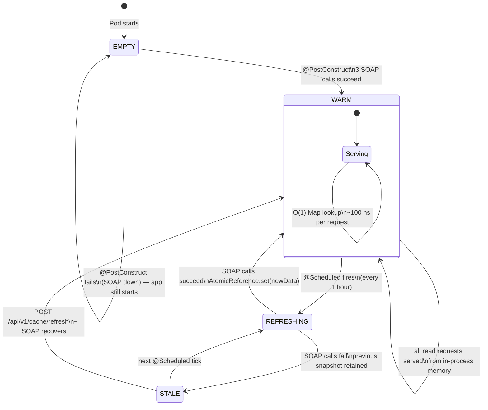
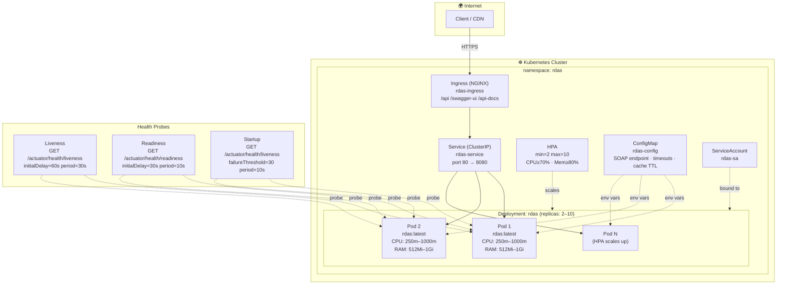
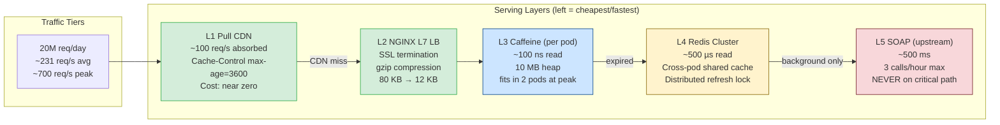

# RDAS – Architecture Document

## Part 1 – Solution Design

### System Overview

```mermaid
graph TB
    subgraph Consumers["🌐 Consumers"]
        MA[Mobile App]
        WA[Web App]
        PA[Partner API]
        OP[Ops Portal]
    end

    subgraph K8S["☸️  Kubernetes Cluster (namespace: rdas)"]
        direction TB

        subgraph Ingress["Ingress Layer"]
            IG[NGINX Ingress\n/api  /swagger-ui  /api-docs]
        end

        subgraph Pods["RDAS Pod  ×2–10  (HPA)"]
            direction TB

            subgraph Controllers["Controllers (Spring MVC)"]
                CC[CountryController\nGET /api/v1/countries]
                RC[ReferenceDataController\nGET /continents /currencies /languages]
                CacheCTRL[CacheController\nGET|POST /api/v1/cache]
            end

            subgraph Service["Service Layer"]
                CS[CountryServiceImpl\nFilter · Sort · Paginate]
            end

            subgraph Cache["Cache Layer"]
                AR["AtomicReference&lt;CachedData&gt;\n(Caffeine · max 500 · TTL 2 h)"]
                CD["CachedData\ncountries · continents\ncurrencies · indices"]
            end

            subgraph Background["Background Tasks"]
                PC["@PostConstruct\nwarm-up"]
                SC["@Scheduled\nhourly refresh"]
            end

            subgraph Client["SOAP Client"]
                SC2[CountryInfoSoapClient\nXXE-hardened · RestTemplate]
            end

            subgraph Observability["Observability"]
                HI[SoapServiceHealthIndicator\n/actuator/health]
                SW[SpringDoc OpenAPI\n/swagger-ui.html]
            end
        end

        CM[ConfigMap\nrdas-config]
    end

    subgraph Upstream["☁️  External SOAP Service"]
        SOAP["CountryInfo WSDL\nwebservices.oorsprong.org\nFullCountryInfoAllCountries\nListOfContinentsByName\nListOfCurrenciesByName"]
    end

    MA & WA & PA & OP -->|HTTPS REST/JSON| IG
    IG -->|routes| CC & RC & CacheCTRL
    CC & RC & CacheCTRL --> CS
    CS --> AR
    AR --- CD
    PC & SC --> SC2
    SC2 -->|HTTP SOAP| SOAP
    SC2 -->|parsed DTOs| AR
    CM -.->|env vars| Pods
    HI --- AR
```

### Request Flow

```mermaid
sequenceDiagram
    actor Client
    participant CDN as Pull CDN
    participant LB as L7 Load Balancer
    participant Pod as RDAS Pod
    participant Cache as AtomicReference&lt;CachedData&gt;
    participant SOAP as CountryInfo SOAP

    Client->>CDN: GET /api/v1/countries
    alt Cache-Control hit (max-age=3600)
        CDN-->>Client: 200 OK (cached)
    else CDN miss
        CDN->>LB: forward
        LB->>Pod: route to least-loaded pod
        Pod->>Cache: getData()
        alt Cache populated
            Cache-->>Pod: CachedData snapshot (atomic read)
            Pod-->>CDN: 200 OK + Cache-Control header
            CDN-->>Client: 200 OK
        else Cache empty (cold start + SOAP down)
            Pod-->>Client: 503 Service Unavailable
        end
    end

    Note over Pod,SOAP: Background refresh (every 1 hour)
    Pod->>SOAP: FullCountryInfoAllCountries (3 SOAP calls)
    SOAP-->>Pod: XML response
    Pod->>Cache: AtomicReference.set(newSnapshot) — atomic swap
```

### Cache Lifecycle



### Components

| Component | Responsibility |
|-----------|---------------|
| `CountryInfoSoapClient` | Raw HTTP SOAP calls; XXE-safe XML parsing; returns typed DTOs |
| `ReferenceDataCache` | Holds `AtomicReference<CachedData>`; `@PostConstruct` warm-up; `@Scheduled` hourly refresh |
| `CachedData` | Immutable snapshot; pre-built `HashMap` indices for O(1) country and currency lookup |
| `CountryServiceImpl` | In-memory filtering, sorting and pagination on cached data |
| `GlobalExceptionHandler` | Unified `ErrorResponse` for all failure modes |
| `SoapServiceHealthIndicator` | Actuator `/actuator/health` reports cache age and record counts |

### Key Design Decisions

**Single SOAP call strategy**  
`FullCountryInfoAllCountries` returns all ~250 countries in one SOAP call. Two additional calls (`ListOfContinentsByName`, `ListOfCurrenciesByName`) enrich country records with human-readable names. Total: **3 SOAP calls at startup**, then zero for all subsequent requests.

**AtomicReference vs Spring @Cacheable**  
Spring's `@Cacheable` evicts the entry before re-fetching, creating a brief window with no data. `AtomicReference` swaps atomically – readers always see a complete snapshot (either previous or new). This is critical for the stale-data fallback during SOAP outages.

**In-process cache vs Redis**  
For a reference dataset that is read-heavy, rarely changes, and fits easily in 10 MB of heap, an in-process Caffeine cache gives sub-millisecond reads with zero network hops. Redis is the natural next step when horizontal scaling creates pod-per-pod warm-up costs or when consistency across replicas is required.

---

## Part 3 – Data Processing Challenge

### How the design reduces SOAP traffic

| Scenario | SOAP calls |
|----------|-----------|
| Service startup | 3 (continents, currencies, all countries) |
| Normal operation (hourly refresh) | 3 per hour = 72 per day |
| Per user request | **0** |

With a 100 req/min SOAP quota the service uses **< 0.05 %** of the limit.

### What data is cached

| Data | Cache name | Source operation |
|------|-----------|-----------------|
| All country details (enriched) | `AtomicReference<CachedData>.countries` | `FullCountryInfoAllCountries` |
| Continents | `AtomicReference<CachedData>.continents` | `ListOfContinentsByName` |
| Currencies | `AtomicReference<CachedData>.currencies` | `ListOfCurrenciesByName` |
| Languages | Derived from countries | — |
| O(1) lookup indices | `Map<String, CountryDto>`, `Map<String, List<CountryDto>>` | Built at `CachedData` construction |

### Cache expiration strategy

- **Active TTL**: data is refreshed every **1 hour** (configurable via `rdas.cache.refresh-interval-ms`).
- **Stale-data safety net**: data is served from the previous snapshot if the SOAP refresh fails. Staleness is reported via `GET /api/v1/cache/status` and `/actuator/health`.
- The `SoapServiceHealthIndicator` flags the health as `DOWN` when cache age exceeds `2 × refresh-interval`.

### Cache refresh strategy

1. `@PostConstruct` – synchronous warm-up on startup; if it fails (SOAP down), the app still starts and the scheduled task retries.
2. `@Scheduled(fixedDelay = ${rdas.cache.refresh-interval-ms})` – background refresh every hour.
3. `POST /api/v1/cache/refresh` – manual/admin-triggered immediate refresh.
4. **Atomic swap**: `cache.set(newData)` is a single CAS operation. Concurrent readers always see a consistent snapshot.

---

## Part 4 – Resilience Challenge

### SOAP unavailable for 6 hours

**What happens when a request arrives**

| Cache state | Behaviour |
|-------------|-----------|
| Cache populated (stale) | Request succeeds; stale data is returned; `cache.status` shows age |
| Cache never populated | `503 Service Unavailable` with a clear message |

**How users experience the failure**

- The API continues serving responses with last-known-good data.  
- No consumer sees an error unless the service has *never* had valid data (cold start + SOAP down).
- The `/actuator/health` endpoint reports `DOWN` (cache age > 2 h) – Kubernetes readiness probe can optionally use this.

**Fallback mechanisms**

1. **Stale cache** – the `AtomicReference` is never cleared on failure; the previous snapshot is retained indefinitely.  
2. **Admin refresh endpoint** – once SOAP recovers, `POST /api/v1/cache/refresh` immediately reloads data without waiting for the next scheduled run.  
3. **(Recommended for production)** – Persist last-known-good snapshot to a database so pods can survive full restarts while SOAP is down.
4. **(Recommended for production)** – Resilience4j circuit breaker wraps SOAP calls; fails fast after N errors rather than timing out each time.

**Monitoring and alerting that should be triggered**

| Signal | Source | Alert |
|--------|--------|-------|
| Cache age > 2 h | `SoapServiceHealthIndicator` | PagerDuty / Opsgenie P2 |
| Cache empty | `SoapServiceHealthIndicator` → `DOWN` | PagerDuty P1 |
| SOAP call exception rate | Micrometer `rdas.soap.error` counter | Alert if > 5 failures in 5 min |
| K8s pod readiness failing | Readiness probe | K8s restarts / HPA stops scaling in |
| 503 response spike | API Gateway metrics | Alert if > 1 % of requests return 503 |

---

## Kubernetes Deployment Architecture



## Scaling Strategy


